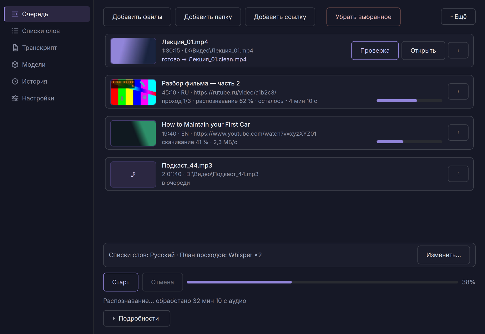
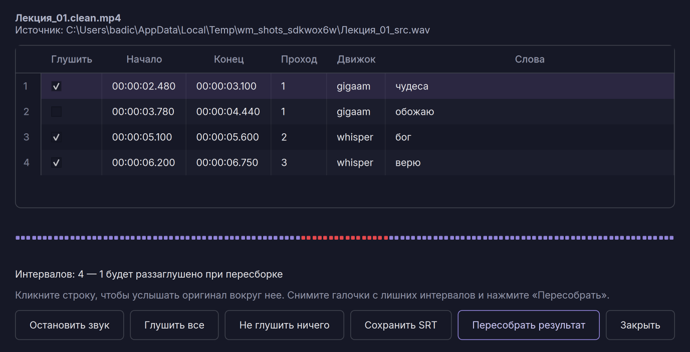

# WordMute

**Находит нежелательные слова в аудиодорожке видео и точечно заглушает
их. Полностью на вашем компьютере — файлы никуда не отправляются.**

🌐 **Сайт и скачивание: [baudi2.github.io/wordmute](https://baudi2.github.io/wordmute/)**
· [Последний релиз](https://github.com/Baudi2/wordmute/releases/latest)
· [Инструкция по установке](docs/INSTALL_GUIDE.md)



## Как это работает

1. **Распознавание** — faster-whisper (опционально GigaAM для русской
   речи) расшифровывает аудиодорожку с точной временной меткой каждого
   слова.
2. **Поиск** — расшифровка сверяется с вашим списком слов: точные
   слова, основы (`корень*`), вхождения (`*корень*`) и целые фразы.
   Готовые словари для русского и английского уже включают словоформы.
3. **Заглушение** — ffmpeg глушит найденные сегменты в звуке, не трогая
   видеоряд. На выходе тот же файл без нежелательных слов.

## Возможности

- **Экран проверки** — каждое заглушенное слово можно прослушать в один
  клик и снять заглушку с ложных срабатываний; пересборка занимает
  секунды, без повторного распознавания.
- **Загрузка по ссылке** — YouTube, VK Видео и другие площадки, выбор
  качества; закрытые видео по подписке (Boosty) — через файл cookies.
- **Свои списки слов** — редактируйте словари под себя прямо в
  приложении, с проверкой «почему это слово заглушится».
- **Ускорение на GPU** — с видеокартой NVIDIA распознавание в разы
  быстрее; без неё тоже работает.
- Пищание вместо тишины, экспорт транскрипта в SRT, история обработок,
  тёмная и светлая темы, интерфейс на русском и английском.



## Установка

Скачайте установщик с [сайта](https://baudi2.github.io/wordmute/) или
из [релизов](https://github.com/Baudi2/wordmute/releases/latest) и
запустите. Установщик лёгкий (~160 МБ); при первом запуске приложение
само скачает нужные компоненты (0,4–2,5 ГБ), а при первой обработке —
модель распознавания (~3 ГБ).

Перед установкой:

- **~6–8 ГБ** свободного места на диске;
- стабильный интернет; в России на время установки может понадобиться
  **VPN** (python.org, pypi.org и huggingface.co бывают заблокированы);
- предупреждение Windows SmartScreen при запуске — это нормально для
  новых программ без платной подписи: «Подробнее» → «Выполнить в любом
  случае».

**Проблемы с установкой?** Скопируйте содержимое
[docs/INSTALL_GUIDE.md](docs/INSTALL_GUIDE.md) в любой ИИ-ассистент
(ChatGPT, Claude и др.) и опишите проблему — он проведёт вас по шагам.
На [сайте](https://baudi2.github.io/wordmute/) есть кнопка, которая
копирует инструкцию одним нажатием.

## Запуск из исходников

```
git clone https://github.com/Baudi2/wordmute.git
cd wordmute
pip install PySide6 faster-whisper yt-dlp
python -m wordmute_app
```

Нужен ffmpeg в PATH. Тесты: `python -m pytest tests`. Подробности
архитектуры — в [docs/DEVELOPMENT.md](docs/DEVELOPMENT.md).

---

## English

WordMute is a Windows desktop app that finds unwanted words in a
video's audio track using local speech recognition (faster-whisper /
GigaAM) and precisely mutes them with ffmpeg — the video stream is
copied untouched, and nothing leaves your computer. Word lists support
exact words, stems, substrings and phrases; ready-made Russian and
English dictionaries are included and freely editable. After
processing, a review screen lets you audition every muted interval and
un-mute false positives with a seconds-fast re-render. The interface is
available in English and Russian.

Download from the [website](https://baudi2.github.io/wordmute/) or
[releases](https://github.com/Baudi2/wordmute/releases/latest). The
installer is small (~160 MB) and downloads its components (0.4–2.5 GB
plus a ~3 GB speech model) on first run. If anything goes wrong, paste
[docs/INSTALL_GUIDE.md](docs/INSTALL_GUIDE.md) into any AI assistant —
it is written to walk you through the installation. Developer notes:
[docs/DEVELOPMENT.md](docs/DEVELOPMENT.md).
